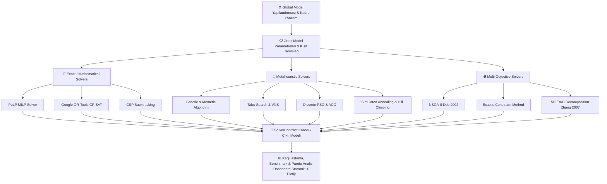

# 📅 Hemşire Çizelgeleme Problemi (NSP) & Sanayi Vardiya Optimizasyonu Platformu

[](https://www.python.org/)
[](https://streamlit.io/)
[](https://developers.google.com/optimization)
[](https://coin-or.github.io/pulp/)
[](LICENSE)

> **Yöneylem Araştırması (Operations Research), Matematiksel Programlama ve Metasezgisel Optimizasyon Teknolojileri ile Geliştirilmiş Karar Destek ve Kıyaslama (Benchmarking) Platformu.**

---

## 📌 Proje Hakkında

Bu proje, Yöneylem Araştırması alanının en karmaşık *NP-hard* problemlerinden biri olan **Hemşire Çizelgeleme Problemi (Nurse Scheduling Problem - NSP / NRP)** ve ağır sanayi kollarındaki (örn. Çelik Üretim Tesisleri) vardiya/posta planlama süreçlerini çözmek üzere geliştirilmiş uçtan uca modüler bir optimizasyon ve karar destek platformudur.

Platform; **Matematiksel / Kesin Çözücüler (MILP & CP-SAT)**, **Tek ve Popülasyon Tabanlı Metasezgiseller** ve **Çok Amaçlı Optimizasyon Algoritmalarını (NSGA-II, MOEA/D, $\epsilon$-Constraint)** aynı kanonik veri modeli altında birleştirerek performans, yakınsama süresi ve çözüm kalitesi açısından karşılaştırmalı analiz yapma imkanı sunar.

---

## 🏗️ Mimari ve Çözücü Akışı (Architecture)

Tüm çözücüler, sistem içerisindeki `SolverContract` arayüzü sayesinde standartlaştırılmış kanonik bir veri yapısı üzerinden haberleşir.



---

## ⚡ Desteklenen Çözücüler ve Algoritmalar (15+ Solvers)

Platform bünyesinde 19 farklı sekmede 15'ten fazla optimizasyon çözücüsü aktif olarak çalışmaktadır:

| Kategori | Algoritma / Çözücü | Açıklama & Kütüphane |
| :--- | :--- | :--- |
| **Kesin Çözücüler (Exact)** | **MILP (Integer Programming)** | `PuLP` kütüphanesi kullanılarak kurulan Tam Sayılı Doğrusal Programlama modeli. Global optimum garantisi. |
| | **Google OR-Tools CP-SAT** | Kısıt Programlama ve SAT çözücüsü. Karmaşık ergonomik kısıtlarda yüksek performans. |
| | **CSP Backtracking** | Kısıt Tatmin Problemi (CSP) derinlemesine arama ve budama (pruning) yaklaşımı. |
| **Sezgisel (Heuristics)** | **Greedy Simulation** | Kural tabanlı hızlı açgözlü vardiya atama simülasyonu. |
| **Tek Durumlu Metasezgiseller** | **Hill Climbing** | Yerel arama ve komşuluk değişimi tabanlı tırmanma algoritması. |
| | **Simulated Annealing (SA)** | Sıcaklık soğutma çizelgesi ile lokal optimumlardan kaçabilen benzetim tabanlı tavlama. |
| | **Tabu Search (TS)** | Tabu listesi ve yasaklı hamle hafızası ile esnek komşuluk araması. |
| | **Variable Neighborhood Search (VNS)** | Değişken komşuluk yapısı ve sarsma (shaking) mekanizmalı metasezgisel. |
| **Popülasyon Tabanlı Sezgiseller**| **Genetic Algorithm (GA)** | Çaprazlama (crossover), mutasyon ve elitizm mekanizmalı evrimsel algoritma. |
| | **Memetic Algorithm (MA)** | GA popülasyon evriminin yerel arama (local search) ile hibritlenmiş hali. |
| | **Discrete PSO (Swarm)** | Ayrık Parçacık Sürü Optimizasyonu (Kişisel ve küresel en iyi deneyim aktarımı). |
| | **ACO (Ant Colony)** | Karınca Kolonisi Optimizasyonu ve feromon güncelleme matrisi ile vardiya rotalama. |
| **Çok Amaçlı (Multi-Objective)** | **NSGA-II (Deb 2002)** | Baskın olmama derecelendirmesi (Non-dominated sorting) ve sıkışıklık mesafeli Pareto GA. |
| | **$\epsilon$-Constraint Method** | MILP/CP-SAT kullanarak matematiksel olarak kesin Pareto Yüzeyi üretimi. |
| | **MOEA/D (Zhang 2007)** | Çok amaçlı problemi ağırlıklı alt problemlere ayrıştıran evrimsel algoritma. |

---

## 📋 Modellenen Kısıtlar ve Ergonomik Kurallar

### 🔴 Sert Kısıtlar (Hard Constraints - Sağlanması Zorunlu)
* **Vardiya Başına Minimum Kadro:** Gündüz, Akşam ve Gece vardiyalarında belirlenen minimum personel sayısının karşılanması.
* **Kesintisiz Vardiya Sınırı:** Bir çalışanın üst üste çalışabileceği maksimum gün sayısı.
* **Günde Maksimum Tek Vardiya:** Bir çalışana aynı gün içinde birden fazla vardiya yazılamaz.

### 🔵 Yumuşak Kısıtlar & Ceza Fonksiyonları (Soft Constraints - Minimize Edilenler)
* **Posta Takım Bütünlüğü:** Ekip ruhu için aynı takımdaki çalışanların aynı vardiyaya atanması tercih edilir.
* **Sirkadiyen Ritim Koruması:** Akşam vardiyasından hemen sonraki gün Gündüz vardiyasına geçiş yasağı (uyku ve dinlenme sağlığı).
* **Gece Nöbeti Adaleti:** Gece nöbetlerinin çalışanlar arasında eşit ve adil dağıtılması.
* **Kıdem & Usta Dengesi:** Her vardiyada en az bir kıdemli/usta personelin bulunması.
* **Kişisel İzin Talepleri:** Çalışanların tercih ettiği özel izin tarihlerine uyulması.

---

## 🚀 Kurulum ve Çalıştırma (Quick Start)

### Gereksinimler
Proje Python 3.9+ ortamında sorunsuz çalışmaktadır.

```bash
# Repoyu klonlayın
git clone https://github.com/TolgaOKurt/Scheduling-Problem_TolgaKurt.git
cd Scheduling-Problem_TolgaKurt

# Gerekli bağımlılıkları yükleyin
pip install streamlit ortools pulp numpy scipy plotly pandas matplotlib seaborn scikit-learn
```

### Uygulamayı Başlatma

#### Windows (Tek Tıkla):
Klasör içerisindeki `UYGULAMAYI_BASLAT.bat` dosyasına çift tıklayarak uygulamayı başlatabilirsiniz.

#### Komut Satırı ile:
```bash
python -m streamlit run app.py
```
Uygulama otomatik olarak varsayılan tarayıcınızda `http://localhost:8501` adresinde açılacaktır.

---

## 📂 Proje Dizin Yapısı

```
Scheduling-Problem_TolgaKurt/
├── app.py                          # Streamlit Ana Giriş & Sekme Navigasyonu
├── config.py                       # Özel CSS Stilleri ve Tema Yapılandırması
├── global_state.py                 # Ortak Model Parametreleri & Kadro Yönetimi
├── UYGULAMAYI_BASLAT.bat           # Windows Otomatik Başlatma Scripti
├── algorithms/                     # Optimizasyon Çözücüler Modülü
│   ├── solver_contract.py          # Standart Kanonik Çıktı Sözleşmesi
│   ├── penalty_calculator.py       # Ceza Puanı ve Kısıt İhlal Hesaplayıcı
│   ├── worker_manager.py           # Çalışan Profilleri ve Sentetik Veri Üretici
│   ├── ilp_pulp_solver.py          # PuLP MILP Çözücü
│   ├── cp_sat_solver.py            # Google OR-Tools CP-SAT Çözücü
│   ├── genetic_algorithm_solver.py # Genetik Algoritma
│   ├── memetic_algorithm_solver.py # Memetik Algoritma
│   ├── nsga2_solver.py             # NSGA-II Çok Amaçlı Algoritma
│   ├── epsilon_constraint_solver.py# ε-Constraint Kesin Pareto Çözücü
│   ├── moead_solver.py             # MOEA/D Çok Amaçlı Ayrıştırma Algoritması
│   └── ... (Diğer tüm çözücüler)
└── views/                          # Streamlit Görünüm ve Sekme Arayüzleri
    ├── common_components.py        # Ortak Grafikler ve Metrik Kartları
    ├── tab1_nsp_intro.py           # NSP Tanımı ve Teorik Çerçeve
    ├── tab3_steel_model.py         # Çelik Tesis Modeli ve Sanayi Kısıtları
    ├── tab_comparison.py           # Tüm Çözücüler Arası Benchmark Analizi
    └── ... (19 Sekmenin Arayüz Kodları)
```

---

## 📚 Akademik Referanslar

1. **Deb, K., Pratap, A., Agarwal, S., & Meyarivan, T. (2002).** *A fast and elitist multiobjective genetic algorithm: NSGA-II.* IEEE Transactions on Evolutionary Computation, 6(2), 182-197.
2. **Zhang, Q., & Li, H. (2007).** *MOEA/D: A multiobjective evolutionary algorithm based on decomposition.* IEEE Transactions on Evolutionary Computation, 11(6), 712-731.
3. **Burke, E. K., et al. (2004).** *The state of the art of nurse rostering.* Journal of Scheduling, 7(6), 441-499.

---

## 👨‍💻 Yazar & İletişim

**Tolga Kurt**  
*Yıldız Teknik Üniversitesi - Matematik Mühendisliği*  
📧 Email: tolgaokurt@outlook.com  
🔗 LinkedIn: [linkedin.com/in/tolgaokurt](https://www.linkedin.com/in/tolgaokurt/)  
🐙 GitHub: [github.com/TolgaOKurt](https://github.com/TolgaOKurt)
